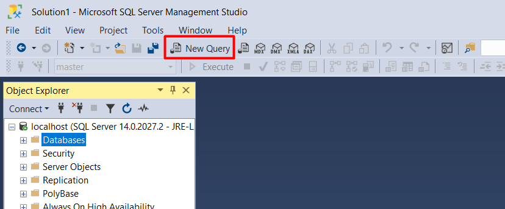
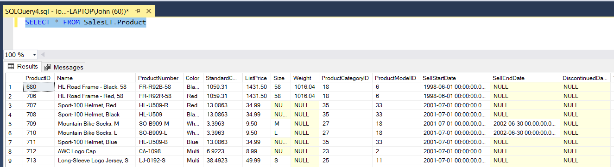

# Table of Contents

- [SQL Server](#sql-server)
  * [Install SQL Server on your machine](#install-sql-server-on-your-machine)
- [Install SQL Server tools](#install-sql-server-tools)
  * [Sql Server Management Studio](#sql-server-management-studio)
  * [Azure Data Studio](#azure-data-studio)
- [Setup the Sample Database](#setup-the-sample-database)
  * [AdventureWorks](#adventureworks)

# SQL Server
You will need access to a SQL Server instance for this course.  There are two options for this:
1. Install SQL Server on your machine (this option is only supported on Windows)
2. Sign up for a free Azure account and host the database there.

Option 1 takes a bit more work, but it is recommended because you will be able to access your SQL server at anytime.  With option 2, you will need internet access to use your server.

## Install SQL Server on your machine
1. Download SQL Server Developer from https://go.microsoft.com/fwlink/?linkid=853016
2. Run the installer and choose the custom option


3. Select a folder in which to save the installation files and click install


4. Wait for the installation files to download


5. Once this is complete, the SQL Server Installation center will open.  If not, you can run the Setup.exe program under the Developer_ENU folder located in the installation path


6. Choose the Installation option on the left side, then click 'New SQL Server standalone-installation or add features to an existing installation'


7. This will launch the setup wizard.  Click next


8. Accept the license terms and click next


9. The wizard should go through the next steps automatically.  Under Install Rules, you may see a warning about Windows Firewall, which you can disregard.


10. In the next step, you will choose the features to install.  At this point, you only need to choose 'Database Engine Services'


11. Accept the defaults in the Instance Configuration screen


12. Accept the defaults in the Server Configuration screen


13. In the Database Engine Configuration, choose Windows Authentication, and be sure to use the Add Current User option to specify SQL Server administrators


14. In the Ready to Install screen, click Install


15. Wait for the installation to complete, then click close


# Install SQL Server tools
## Sql Server Management Studio
Sql Server Management Studio(SSMS) is a standard tool used to develop and administer Microsoft SQL Server databases.  Install and configure SSMS as follows:

1. Download SSMS from https://aka.ms/ssmsfullsetup
2. Run the installer and go through the steps
3. Launch SSMS.  When you launch, you will be presented with a dialog to connect to your database.  Type 'localhost' into the Server name box and click connect.


## Azure Data Studio
Azure Data Studio is a lightweight, cross-platform alternative to SSMS that is focused on SQL development.  Install and configure Azure Data Studio as follows:

1. Download Azure Data Studio from https://docs.microsoft.com/en-us/sql/azure-data-studio/download?view=sql-server-ver15
2. Run the installer and go through the steps
3. Launch Azure Data Studio.  On the right pane, you will connect to your database.  Choose Micrsoft SQL Server for the connection type, and type 'localhost' into the Server field, and Windows Authentication for Authentication type.  Then click connect.


# Setup the Sample Database
## AdventureWorks
1. Download the backup file from https://github.com/jredwardson/intro-to-sql/raw/master/databases/AdventureWorksLT2012.bak
2. Copy the backup file to `C:\Program Files\Microsoft SQL Server\MSSQL14.MSSQLSERVER\MSSQL\Backup\AdventureWorksLT2012.bak`
3. Open SSMS and connect to your server, and click New Query (or use the shortcut Ctrl-N).



4. Paste the following script into the query window:
``` USE [master]
RESTORE DATABASE [AdventureWorksLT2012] 
FROM  DISK = N'C:\Program Files\Microsoft SQL Server\MSSQL14.MSSQLSERVER\MSSQL\Backup\AdventureWorksLT2012.bak' 
WITH  FILE = 1,  
MOVE N'AdventureWorksLT2008_Data' TO N'C:\Program Files\Microsoft SQL Server\MSSQL14.MSSQLSERVER\MSSQL\DATA\AdventureWorksLT2012_Data.mdf',  
MOVE N'AdventureWorksLT2008_Log' TO N'C:\Program Files\Microsoft SQL Server\MSSQL14.MSSQLSERVER\MSSQL\DATA\AdventureWorksLT2012_log.ldf',  
NOUNLOAD,  STATS = 5

GO
```
5. Click Execute(or use the shortcut F5)  
6. Click Refresh in the Object Explorer, then expand the Databases node.  You should see AdventureWorksLT2012 in the list.


7. Test it out by right clicking on AdventureWorksLT2012 in the Object explorer, and choosing New Query.  Then paste the following script in the query editor window

```
SELECT * FROM SalesLT.Product
```

8. Click Execute(F5), and you should see the query results in bottom pane:

